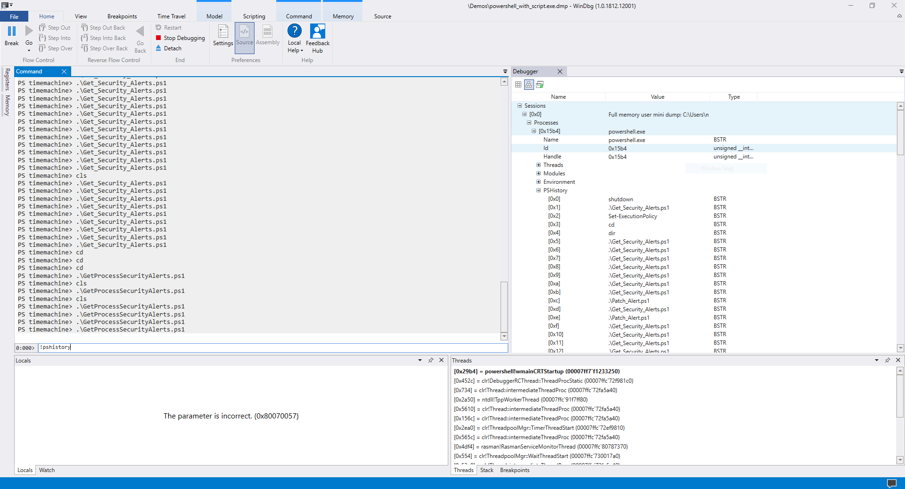

# PSHistory
## Background
This is just an extension of the RawCOM sample which is provided at `DataModelHelloWorld\RawCOM\SimpleIntroRawCOM` with a pratical use case where the Data Model is used to display the PowerShell history.

After reading Lee Holmes blogposts[2][3], I initially wrote some dx scripts[1] to start playing with the Data Model and then after asking[4] Andy Luhrs on Twitter - they finally published some [RawCOM samples](https://github.com/Microsoft/WinDbg-Samples/tree/master/DataModelHelloWorld/RawCOM).

A C++17 version will be officially available by the WinDbg Team which will simplify greatly how to leverage the Data Model but I wanted to learn more about it and the current internals of DbgModel so I could not wait.

Also [Alex Ionescu](https://twitter.com/aionescu) spotted the DbgModel.h header back in early 2018[5], so I figured publishing the first practical Data Model compilable extension would be a fun thing to do, and retrieving PowerShell history happened to be a fun case study.

[1] [WinDbg dx scripts for PowerShell History and Script recovery (Matt Suiche) - 18 Jan 2019](https://gist.github.com/msuiche/2324aa8147c483a7a3e7d1b2d23ee407#file-getpowershellinfo-ps1-L23)
[2] [Extracting Forensic Script Content from PowerShell Process Dumps (Lee Holmes) - 17 Jan 2019](http://www.leeholmes.com/blog/2019/01/17/extracting-forensic-script-content-from-powershell-process-dumps/)
[3] [Extracting Activity History from PowerShell Process Dumps (Lee Holmes) - 4 Jan 2019](https://www.leeholmes.com/blog/2019/01/04/extracting-activity-history-from-powershell-process-dumps/)
[4] https://twitter.com/aluhrs13/status/1086392369086263296
[5] https://twitter.com/aionescu/status/963867032595959808

Command is `!pshistory`

