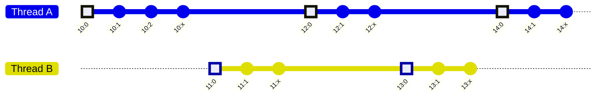
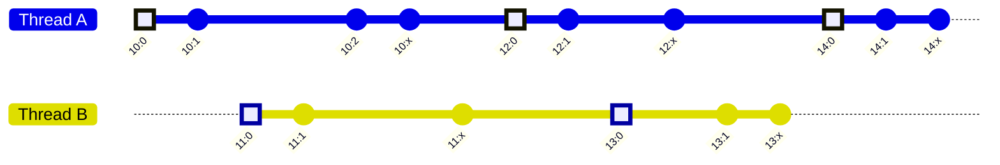

# TTD Concepts

This page introduces the core concepts behind Time Travel Debugging (TTD) and how they relate to the public APIs in the `Microsoft.TimeTravelDebugging.Apis` SDK. It complements the header-specific docs by explaining the model and vocabulary used across the APIs.

## General concepts

**Guest**: Throughout TTD's documentation and APIs, "guest" is used to reference the process that is or was recorded, along with anything that relates to that process. While the trace file is being recorded this process is running live, so "guest" is used to differentiate it from the recorder itself. Later on, when the trace file is being replayed, "guest" is used to differentiate it from the replay engine and the code that's using it.

**Host**: Throughout TTD's documentation and APIs, "host" is used to reference TTD's own code, along with anything that is interfacing with TTD. While the trace file is being recorded this is used to differentiate the recorder from the guest process that is being recorded. Later on, when the trace file is being replayed, "host" is used to refer to the replay engine and the code that's using it.

**Guest address**: 64-bit value that is used to refer to memory in the guest. It is 64-bit even for 32-bit guests with the upper bits set to zero. It is represented by the `GuestAddress` strong type in TTD's API.

## Trace and Index files

**Trace file**: A portable recording of a single process containing one or more groups of executed CPU instructions between two points in time. In addition, it contains relevant events (exceptions, module load/unload, thread creation/termination, debugger output) and some portions of the process memory. A index file name generally uses the ".run" extension.

**Index file**: A file that provides auxiliary data to accelerate navigation, search, and queries. It is also the only way to recover process memory with reasonable accuracy. All the data it contains is inferred from the trace file and can be rebuilt from it. The index file corresponding to a trace file is stored in the same directory and has the same name, but with the ".idx" extension.

**Temporary index file**: A file that stores intermediate data during the construction of the index file. It is stored in the same directory and has the same name as the index file that's being built, but with the ".idxt" extension. When indexing completed, this file is no longer needed, so it will be deleted.

Trace files can be very large. As a ballpark, for every billion instructions recorded, the trace file can be a few hundred megabytes in size. Trace files of 100 GB or more are usable, as long as there's enough additional storage. As a ballpark, an index file's size is comparable to the size of the trace file that it was built from, and the temporary file can be similar in size, so indexing a trace file can require two (or more) times as much space on disk as the size of the trace file, in addition to the trace file itself.

Loading a trace file that has no index requires scanning the entire file, so it will take time proportional to the size of the file. Once the index file is created, it'll be used to greatly speed up the process of loading the trace file additional times.

## Timeline, positions and execution model

A TTD timeline consists on the ordered list of all CPU instructions and events recorded in the trace file. This timeline can span multiple threads and may contain events originated from outside of the recorded process.

**Step**: An event or instruction in a single thread of execution. Each recorded thread therefore consists on a series of steps. Most steps in a trace will be individual instructions, but TTD adds additional steps to mark significant events. For instance, when a hard exception is hit (access violation, division by zero, floating point exception, etc...), there's an additional step to mark the exception itself. All visible CPU state remains unchanged, the faulting instruction didn't execute, but the exception is signaled as hit.

**Sequence event**: A particular step that marks an event that may result in a visible interaction between threads of execution. The most common sequence events are OS kernel calls and CPU atomic operations. Other sequence events represent breaks in the normal sequence of instructions, for instance when a thread is suspended and then resumed, or when an exception happens. All sequence events in the trace's timeline are identified by a unique **Sequence ID**. Sequence events provide the means to identify or infer the relative ordering of steps originating from different threads of execution. Higher sequence ID events always are ordered after smaller sequence ID events.

**Fragment**: The group of steps between two contiguous sequence events in a single thread of execution. A fragment is TTD's atomic unit of logical execution and all of the steps contained within are considered to happen instantaneously, in relation to other threads. All steps in a fragment are considered equally ordered before, or after, any step that is not part of the fragment.

**Gap**: Gaps are what separates contiguous fragments within a thread. When a fragment ends and a new fragment begins, any number of things may have happened: Other threads may make progress, OS kernel code might get to run, the thread may be suspended for any amount of time, etc... Gaps are categorized by a **gap kind** that indicates the size or severity of the gap, ranging from trivial gaps where potentially nothing of interest happens all the way to continuity break gaps where an arbitrarily large series of CPU instructions weren't recorded.

**Island**: A group of contiguous fragments in a thread with no continuity break gaps. For example, when recording a trace with TTD's "-module" option, the recording will skip code that is not in the given module, creating such a gap and therefore splitting any thread's recording into multiple islands.

**Position**: 128-bit value that identifies a single step on the timeline. It is divided into two 64-bit values, usually presented as hexadecimal with a colon between them (e.g. "1A29:3F7"). The first value is the sequence ID of the previous sequence event in the thread and the second number is the count of steps since that sequence event. Positions provide an global ordering of steps across all threads in the timeline, with the sequence ID as the most significant value. The positions all the steps within a fragment all share the same sequence ID value. Positions that identify a particular step in the timeline are said to be valid. Not every position value identifies a valid step, but all possible values are admitted by the replay engine and will be adjusted to the nearest valid position.

**Execution model**: The ordering of fragments is the basis of TTD's execution model. It represents an approximation of the ordering of events as observed while recording the trace and it results from a compromise between recording performance, trace file size and accuracy. Consider this diagram:

The diagram represents 5 fragments present in two threads. The fragments are shown ordered as TTD's replay engine orders them, by their sequence IDs. According to this ordering, position 11:0 logically appears after position 10.2. However, during recording, it is possible that the event or instruction indicated by position 11:0 actually happened before the event or instruction indicated by position 10:2. Considering that the recorder is capable of recording multiple threads running on multiple cores simultaneously, this level of fidelity would be impossible to record with a practical level of performance and trace size.

For example, looking at the series of fragments presented above, one possible ordering at record time could have been like this:

This execution model provides a faithful ordering between sequence events or instructions. 10:0 did happen strictly before 11:0 during recording, and so on. Therefore we also know that 13:1, for instance, did happen after 10:2, because 12:0 is on the same thread as 10:2. The same can be said about 14:1 happening after 11:1.

In order to increase the accuracy of the execution model, the recorder may limit the size of fragments by inserting a new sequence ID at any instruction of its choosing.

**Multi-processes timeline**: When multiple processes are recorded simultaneously, they share a common timeline. This can be verified by matching the `TraceInfo::GroupId` value returned by the traces recorded from each process. Sharing a common timeline means that the fragments from the guest threads recorded from all the processes are ordered in the same manner as fragments from the threads of a single process. This allows synchronization and communication between processes to be observed with as much fidelity as synchronization and communication between threads.

## Cursors and Replay

**Cursor**: A stateful object that represents a movable viewpoint on the timeline. A cursor has a current position and exposes contextual queries and execution control. It is analogous to the prompt of a command-based debugger tool.
- See: [`ICursorView` and `ICursor`](IReplayEngine.h/interface-ICursorView.md).

**Queries**: At the current position, cursor queries provide information about active thread(s) and their registers, memory contents, modules loaded, and events.

**Execution**: The cursor can be instructed to move forward/backward or jump to a position, register callback functions to observe and control replay events, and to stop on watchpoints, positions and other events.

**Watchpoints**: A superset of the common "breakpoint" as seen in most debuggers, watchpoints provide visibility to specific events (as specified by the watchpoint description) as they happen during replay. The most common is a "memory watchpoint", which represents events on memory addresses. For instance when the instruction at a particular address is executed, or when a data address is written to. Another type of watchpoint is the "position watchpoint", which happens when a specific position range is traversed.

Other events like call/return instructions, register value changes and gaps can be observed in the same manner as watchpoints.

## Replay operation and callbacks

**Multithreading**: TTD replay is heavily optimized for multi-core computers, and makes extensive use of multithreading and speculation. This presents constraints and challenges to the user of TTD's replay engine, especially when efficiency is required.

**Replay segment**: An internal unit of work processed during replay, consisting of a number of contiguous fragments in a single guest thread. During replay, all the fragments belonging to the same segment are processed in **forward** order in a single host thread, even during backwards replay. They can be observed via callbacks and form the basis of efficient data analysis, mining and extraction out of a trace file. See the sample [`TTD/ReplayApi/TraceAnalysis`](/TTD/ReplayApi/TraceAnalysis/) for an example of this.

**Replay callbacks**: Watchpoints and other events can be observed via callback functions, which may request that replay stop at the event's position. Accessing the cursor object within a callback will cause data races and is generally forbidden, but all event callbacks receive an ``IThreadView`` interface through which they can perform a limited set of queries on the guest thread where the event happened.

It's important to note that TTD's heavily multithreaded replay and speculation means that a watchpoint event observed by a callback function may very well happen at a position that is ordered *after* the position where replay stops. If replay is resumed after it stops, any such "speculated" events will be observed again. Also, the set of speculated events that are observed is effectively unpredictable. Event B that "happens after" event A and "happens before" event C may remain unobserved when replay stops at A, even if C is speculatively observed.

## Modules, threads and exceptions

Without using a cursor, the following items can be queried and iterated. Positions for all events are provided by the `IReplayEngineView` interface, so all these events can be observed via callbacks by using position watchpoints:
- **Modules**: The guest process' main executable and any additional DLLs loaded into the guest. Modules are identified by base address, size, checksum, and timestamp.
- **Module instances**: Individual load lifetimes of a module on the timeline. A single module may be appear to be loaded/unloaded multiple times.
- **Threads**: OS threads observed during recording are identified by a "**unique thread ID**". Note that this ID is defined by TTD and distinct from the OS's own "**thread ID**", because the OS may reuse a thread ID multiple times for multiple disjoint threads. Threads have an "**active time**", which is a range of positions during which the thread was observed, and a "**lifetime**" which is a range of positions during which the thread was alive in the guest process. `position::Min` and `Position::Max` are used for the lifetime's `Min` and `Max` positions if the creation and termination of the thread were not observed by the recorder, respectively.
- **Exceptions**: Includes hardware exceptions (memory access violations, division by zero, floating point exceptions, etc.) as well as software exceptions (like C++ exceptions, debugger output).

## User-defined customization

It is possible for code in the recorded process to interact with the recorder to control the recording and add custom data to the trace file, by using the [TTD/TTDLiveRecorder.h](TTDLiveRecorder.h/README.md) API.

- **Throttle**: Any data, heuristic or action that causes an interruption in the recording. For instance, a limit to the number of instructions recorded as part of an island.
- **Record client**: Some component that interacts with the recorder, using a user-defined GUID as a means of identification.
- **Activity**: A user-defined set of islands in a recording. It is marked at record time with a user-defined 32-bit ID. Islands in an activity don't necessarily belong to the same thread. For instance, when recording a particular asynchronous request-response workflow, a recording component may choose assign the island that performs the request and the island that receives the response to the same activity, so the relation can later be identified when replaying the trace file.
- **Custom events**: Events injected by a record client, to mark a point of interest in the timeline.
- **User data**: User-defined payload that may be attached to record clients (to describe the client), islands and custom events.

## Terminology quick reference

| Term                                       | Description
|--------------------------------------------|------------
| Activity                                   | User-defined set of islands (32-bit ID); may span threads
| Cursor                                     | Movable view onto the timeline exposing context queries and execution control
| Custom events                              | Client-injected timeline markers with optional data payload
| Exceptions                                 | Hardware and software exceptions (e.g., AV, divide-by-zero, FP, C++ exceptions, debugger output)
| Execution                                  | Move/jump control, watchpoints, and callback registration; controls when replay stops
| Execution model                            | Approximate ordering based on fragments/sequence IDs; preserves ordering between sequence events
| Fragment                                   | Steps in one thread between two contiguous sequence events; atomic w.r.t. other threads
| Gap / Gap kind                             | Separation between fragments; categorized by severity up to continuity breaks
| Guest                                      | Recorded process and everything related to it (during record and replay)
| GuestAddress                               | Strongly-typed 64-bit address in the guest’s memory space
| Host                                       | TTD recorder/replay engine and code interfacing with TTD
| Index file                                 | Auxiliary data for fast navigation/search and accurate memory recovery; rebuildable from trace
| Island                                     | Contiguous fragments in a thread with no continuity-break gaps
| Module                                     | Guest executable or DLL; identified by base, size, checksum, timestamp
| Module instance                            | Per-lifetime load/unload of a module on the timeline
| Multi-process timeline                     | Traces from multiple processes that share a common timeline (match TraceInfo::GroupId)
| Multithreading (replay)                    | Replay uses multithreading/speculation; implies callback constraints and possible re-observation
| Position                                   | 128-bit identifier (SequenceID:StepCount) of a step; provides global ordering; non-valid values snap to nearest valid
| Queries                                    | Context at the current position (threads/registers, memory, modules, events)
| Record client                              | Component interacting with the recorder; identified by GUID
| Replay callbacks                           | Invoked on watchpoints/events; receive IThreadView; may request replay stop; speculative events may repeat
| Replay segment                             | Unit of contiguous fragments processed forward in one host thread; exposed via callbacks
| Sequence event                             | Step that may interact across threads (e.g., kernel calls, atomics, suspend/resume, exceptions)
| Sequence ID                                | Globally ordered identifier for sequence events; orders fragments across threads
| Step                                       | Single instruction or event in one thread
| Temporary index file                       | Intermediate data while building the index; deleted when indexing completes
| Threads                                    | Identified by TTD unique thread ID, which is guaranteed never recycled to multiple threads
| Throttle                                   | Recorder-side heuristic/action that interrupts recording (e.g., instruction count limits)
| Timeline                                   | Ordered sequence of recorded instructions and events across threads (and processes)
| Trace file                                 | Portable recording of one process: executed instructions, events, and sampled memory
| User data                                  | Payload attached to record clients, islands, and custom events
| Watchpoints (breakpoints)                  | Declarative stop conditions (memory/code/position, calls/returns, register changes, gaps)

## See also

- API headers overview: [`Microsoft.TimeTravelDebugging.Apis`](Microsoft.TimeTravelDebugging.Apis.md)
- Replay engine: [`IReplayEngine`](IReplayEngine.h/README.md), [`IReplayEngineStl`](IReplayEngineStl.h/README.md)
- Recorder: [`TTDLiveRecorder`](TTDLiveRecorder.h/README.md)
- Core types: [`IdnaBasicTypes.h`](IdnaBasicTypes.h/README.md), [`TTDCommonTypes.h`](TTDCommonTypes.h/README.md)
