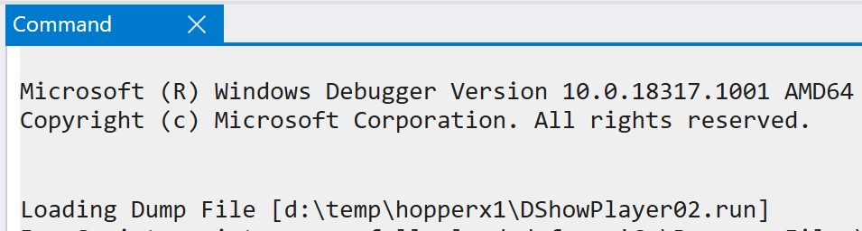
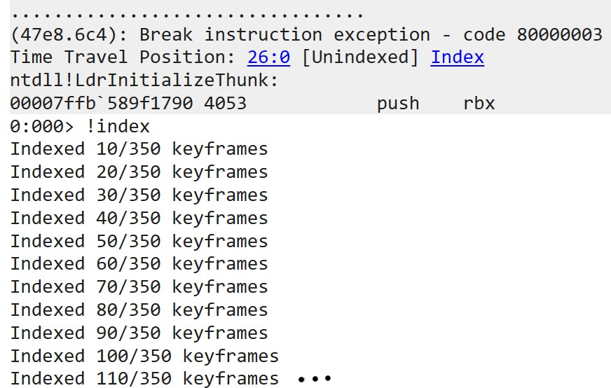
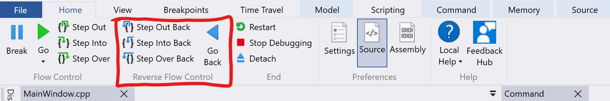
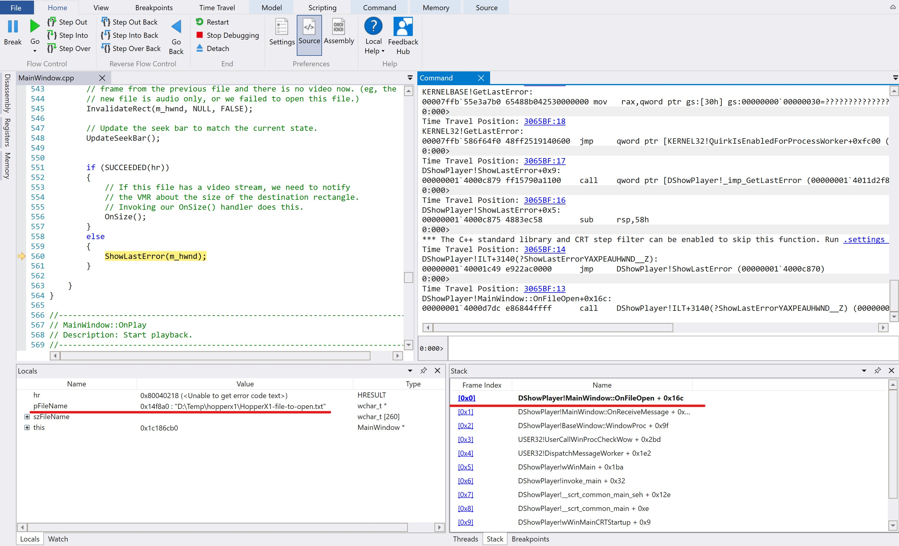

# Time Travel Debugging and Queries

This tutorial demonstrates how to debug C++ code using a [Time Travel Debugging]
recording. This example focuses on the use of Queries to find information about
the execution of the code in question.

## Prerequisites

Note that this tutorial only applies to Windows 10 environments.
Download the following software in order to follow along:

* Windbg Preview from the Windows Store
* Visual Studio 15
* Ability to run processes elevated, with admin privileges

## Prepare program to record

This tutorial will use the program from [app-sample](https://github.com/Microsoft/WinDbg-Samples/tree/HEAD/TTDQueries/app-sample).

1. Open the [solution](https://github.com/Microsoft/WinDbg-Samples/tree/HEAD/TTDQueries/app-sample/DShowPlayer.sln) in Visual Studio and build it.
   * Note that this works with 32 bit or 64 bit built version of the tool. I use the 64 bit version here.
2. Launch/Start the application to make sure it runs as expected.
3. Reproduce the problem:
   1. Click on the 'OpenFile' under the 'File' menu
   2. Choose any non video file to be opened and you will see an error like this:


**Context**:
As you see the error you get in the message box doesn't make sense: "Operation completed successfully".
If you are not familiar with Windows Error API, the error may be cleared/reset
every time a Windows API is called, therefore if you don't call `GetLastError()`
right after the Windows API call you may get a different error. That is what has happened here.

## Recording

1. Launch Windbg Preview elevated by right clicking on its icon and selecting 'Run as Administrator'
2. On the top left, go to 'File' -> 'Start debugging' -> 'Launch executable (advanced)'
3. Copy the full path of the executable you built into the 'Executable' text block
4. Select the 'Record process with Time Travel Debugging' and fill in the 'Output directory' if
you prefer a different location from the default.

At this point in the steps, you should see something like this:


5. Once you select 'OK', the program will be launched and recorded by TTD.

You should see a little dialog with information about the recording in progress:


6. Follow the steps from [Reproduce the problem](#Prepare-program-to-record) to
reproduce the issue
7. Close the program

Note that as soon as the program exists, Windbg Preview will load the recording
for you to replay and/or debug it.

8. Inspect the console output to identify resulting file name (the recording).



9. As soon as the trace file is loaded in Windbg Preview, it will be index.
Check the output in the console window to make sure it was successful.



Indexing a TTD trace file highly improves the replay performance, the look
up of memory values as well as the experience of stepping forwards and
backwards. If indexing fails, simply try to re-index by running `!index -force`.

## Running Queries

Running some of the TTD Queries require the debugger to have loaded symbols
for some modules. For example the Calls query needs to be able to identify
the symbol for the function specified.

1. Make sure Windbg Preview has the right path to the symbols (pdb files) of
your program. In this particular case you compiled the code locally, and you
have the pdb files right next to the executable, therefore the debugger will
find them without issue.
   * Otherwise, add to the debugger's symbol path by running `.sympath+ <pdb path>`

2. Before running your first query, explore the Data Model Object that contains
TTD specific queries. Run this command:

```LINQ
dx @$cursession.TTD
```

You should see something like:


For documentation about the dx command in Windbg Preview go [here](https://docs.microsoft.com/windows-hardware/drivers/debugger/debugger-data-model-function-aliases).

Finding out what caused your program to crash is like detective work, you
need to figure out what happened and where. Think about what questions
would help you understand what took place during execution and/or around
the issue you are investigating.

Then, transform those questions to pertain to functions calls
with certain return and/or inputs values.

And finally, transform the rest of the questions to certain memory
location use (read/write/execute) and/or pattern.

### Using queries to go directly to the point of interest in execution

Can we find out the exact point in time where the program created the message box with
the confusing error?

One way to think about this problem is to list all calls to `MessageBoxW` (Windows
API to show a message box), order it by the start time of the function, and then pick the
last call. That is the point in time where we'll be able to inspect where the error came from:

```LINQ
dx @$cursession.TTD.Calls("user32!MessageBoxW").OrderBy(c => c.TimeStart).Last()

Result:
@$cursession.TTD.Calls("user32!MessageBoxW").OrderBy(c => c.TimeStart).Last()
    EventType        : Call
    ThreadId         : 0x6c4
    UniqueThreadId   : 0x2
    TimeStart        : 306600:5BF [Time Travel]
    TimeEnd          : 30CADE:80 [Time Travel]
    Function         : UnknownOrMissingSymbols
    FunctionAddress  : 0x7ffb578f1e30
    ReturnAddress    : 0x14000c8d1
    ReturnValue      : 0x1
    Parameters
```

We can navigate to that position in time in order to figure out where the error came from.
You can click on the time link ('Time Travel').

Look at the stack and change your frame to frame 0x1, the caller of `MessageBoxW`, by
double clicking on it.


As you can see the error comes from calling GetLastError(). At the point when
GetLastError() is called the real error has been reset. This is likely to happen
if you don't call GetLastError() right after the Windows API that reports the
issue and store the result in a variable.

The next frame down in the stack is our program trying to open a file. We can step back from
this point, to figure out what file it was trying to open.
To do this, click on the backwards 'step over' control in the ribbon of Windbg Preview.



Now that we have stepped backwards, we are able to see what file `DShowPlayer!MainWindow::OnFileOpen()`
was trying to open.



### Using queries to discover patterns in execution data

Maybe you would like to understand what is the pattern around the error's data.
You can write queries and display them in a grid for better visualization. The `-g`
option in dx allows you to enumerable data in a grid display.

We could a get general sense for the errors encountered in our program by looking
at the count of each error reported by `GetLastError()`.
We do this by looking for all the calls to the function `GetLastError()`,
removing calls that return success (value of 0), groping the calls by their return,
and lastly ordering them by frequency.

* Note that queries can become complex, but you always start simple and build on
it as determine how you want to slice the data available in the recording.

```LINQ
dx -g @$cursession.TTD.Calls("kernelbase!GetLastError").Where( x=> x.ReturnValue != 0).GroupBy(x => x.ReturnValue).Select(x => new { ErrorNumber = x.First().ReturnValue, ErrorCount = x.Count()}).OrderByDescending(p => p.ErrorCount),d
```


### Using queries to monitor memory and data structures

Another powerful query in TTD is the Memory query. It allows you to query for
read/write/execute accesses to a memory range. Most debuggers limit the breakpoint
size to 8 bytes max, with TTD Memory queries you can go as big as you would like.

For example, you could write a query than spans an entire binary, and you can build
a code coverage check using the results.
There is an example of a [code coverage from TTD](https://github.com/0vercl0k/windbg-scripts/tree/HEAD/codecov).

In this sample program, we can arrive to the same conclusion as the previous investigation,
but instead we'll use Memory queries to figure out where the error came from and
what file is causing the problem.

First, we need the time when the dialog was created in order to limit our search.
We can store that time in a variable in the debugger in order to use it in a
different query later.

```LINQ
dx @$dialog = @$cursession.TTD.Calls("user32!MessageBoxW").OrderBy(c => c.TimeStart).Last().TimeStart

Result:
@$dialog = @$cursession.TTD.Calls("user32!MessageBoxW").OrderBy(c => c.TimeStart).Last().TimeStart  : 306600:5BF [Time Travel]
    Sequence         : 0x306600
    Steps            : 0x5bf
```

In Windows programs each thread has a known structure that contains all the information
regarding its state. It is called the Thread Environment Block ([TEB](https://docs.microsoft.com/windows/desktop/api/winternl/ns-winternl-_teb)). The result returned by `GetLastError()` is
stored in this data structure.
Windbg Preview allows to query this data structure by running `dx @$teb`. If you
look at the TEB's members you'll see there is a LastErrorValue variable, 4 bytes in size.

So we can run a query to find every read operation done in that range in memory, select
all the reads that happen before the dialog got created and then sort the result to find
the last read operation. Then finally time travel to that point in time by calling
`SeekTo()` on the resulting time position:

```LINQ
dx @$cursession.TTD.Memory(&@$teb->LastErrorValue, &@$teb->LastErrorValue + 0x4, "r").Where(m => m.TimeStart < @$dialog).OrderBy(m => m.TimeStart).Last().TimeEnd.SeekTo()

Result:
Setting position: 3065BF:1A
(47e8.6c4): Break instruction exception - code 80000003 (first/second chance not available)
Time Travel Position: 3065BF:1A
@$cursession.TTD.Memory(&@$teb->LastErrorValue, &@$teb->LastErrorValue + 0x4, "r").Where(m => m.TimeStart < @$dialog).OrderBy(m => m.TimeStart).Last().TimeEnd.SeekTo()
```

Examine the stack at this point in time. As you can see it in the stack, the program
was trying to open a file. Step backwards using the TTD controls to inspect what happened.
As we saw before, at the point when GetLastError() is called the real error has been reset.

The next frame down in the stack is our program trying to open a file. We can step back from
this point, to figure out what file it was trying to open.
To do this, click on the backwards 'step over' control in the ribbon of Windbg Preview.


Now that we have stepped backwards, we are able to see what file `DShowPlayer!MainWindow::OnFileOpen()`
was trying to open.


[Time Travel Debugging]: https://docs.microsoft.com/windows-hardware/drivers/debugger/time-travel-debugging-overview
[Sample folder]: https://github.com/Microsoft/Windows-classic-samples/tree/HEAD/Samples

As you can see, the file that was opened is not a media file, and the video reader
doesn't know how to open such file, causing the program to error.