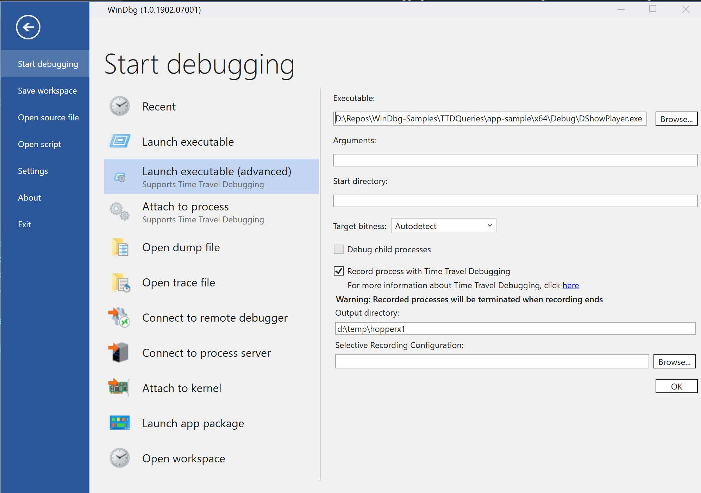
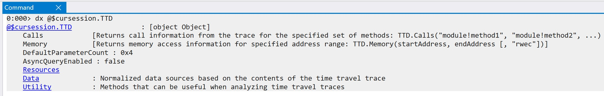
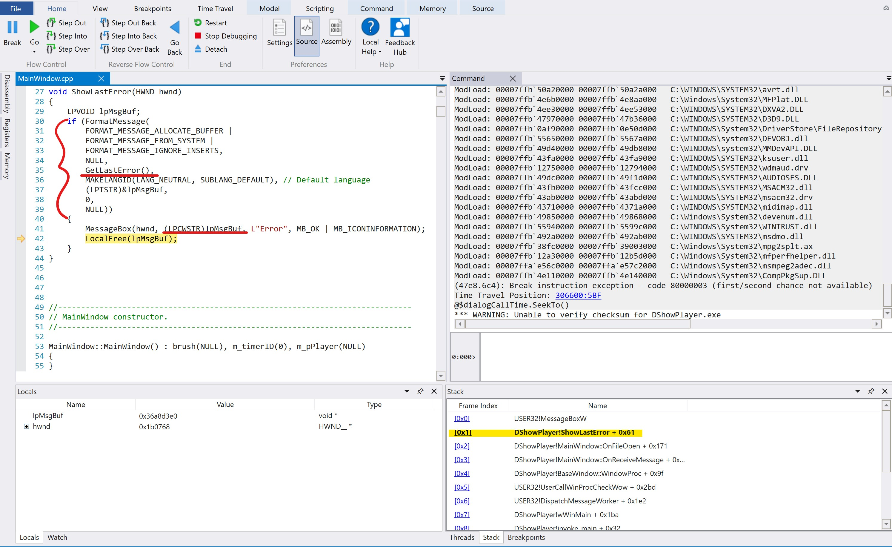

# Time Travel Debugging and Queries

This tutorial demonstrates how to debug C++ code using a [Time Travel Debugging]
recording. This example focuses on the use of Queries to find information about
the execution of the code in question.

## Prerequisites

Note that this tutorial only applies to Windows 10 environments.
Download the following software in order to follow along:

* WindbgNext from the Windows Store
* Visual Studio 15
* Ability to run processes elevated, with admin priviledges 

## Prepare program to record

This tutorial will use the program from [app-sample](https://github.com/Microsoft/WinDbg-Samples/tree/master/TTDQueries/app-sample).

1. Open the [solution](https://github.com/Microsoft/WinDbg-Samples/tree/master/TTDQueries/app-sample/DShowPlayer.sln) in Visual Studio and build it.
2. Launch/Start the application to make sure it runs as expected.
3. Reproduce the problem:
  1. Click on the 'OpenFile' under the 'File' menu
  2. Choose any non video file to be opened and you will see an error like this:

  

## Recording

1. Launch Windbg Preview elevated by right clicking on its icon and selecting 'Run as Administrator'
2. On the top left, go to 'File' -> 'Start debugging' -> 'Launch executable (advanced)'
3. Copy the full path of the executable you built into the 'Executable' text block
4. Select the 'Record process with Time Travel Debugging' and fill in the 'Output directory' if
you prefer a different location from the default.

At this point in the steps you should see something like this:



5. Once you select 'OK', the program will be launched and recorded by TTD.

You should see a little dialog with information about the recording in progress:


6. Follow the steps from [Reproduce the problem](#Prepare-program-to-record) to
reproduce the issue
7. Close the program

Note that as soon as the program exists, Windbg Preview will load the recording
for you to replay and/or debug it.

## Running Queries

1. Make sure your debugger has the right path to the symbols (pdb files) of your program.
  * Add to your debugger's symbol path by running `.sympath+ <sources path>`
2. Explore the Data Model Oject that contains TTD specific queries by running

```
dx @$cursession.TTD
```

You should see something like:



### How to think about investigating this error using queries?

  1. You need to think about the issue as a set of questions that if
  answered will give you more questions to ask, or the answer to what
  you are trying to solve.
  2. Can you transform those questions to pertain to functions calls
  with certain returns and/or inputs?
  3. Can you transform the rest of the questions to certain memory
  location use (read/write/execute)?

### Investigation

**Firt, context**:
    As you can see the error you get in the message box doesn't make sense: "Operation completed successfully".
If you are not familiar with Windows Error API, the error may be cleared/reset
every time a Windows API is called, therefore if you don't call `Kernelbase::GetLastError()`
right after the Windows API call you may get a different error. That is what has happened here.

#### Initial questions:
1. What function call to create a message box showed the error in question?
2. At what position in time did this call occur, and where did the error come from?

List all calls to `user32!MessageBoxW` (Windows API to show a message box) in order,
then pick the last call, since that is what we are looking for:

```LINQ
dx @$cursession.TTD.Calls("user32!MessageBoxW").OrderBy(c => c.TimeStart).Last()
```

Since we will likely need to know at what position in time this call took place,
let's store the time when the call occured in a variable:

```LINQ
dx @$dialogCallTime = @$cursession.TTD.Calls("user32!MessageBoxW").OrderBy(c => c.TimeStart)
.Last().TimeStart
```

Now, let's navigate to that position in time in order to figure out where the error came from:



It looks like the error is a typical Windows HRESULT error, which is obtained by calling
`KernelBase::GetLastError()`. Let's get all the positions in time where the error
of Windows APIs were read. We do this by looking for all the calls to the function
`KernelBase::GetLastError()` and maybe order them by frequency.
*Note that the `-g` option for dx shows the data in a grid display*

```LINQ
dx -g @$cursession.TTD.Calls("kernelbase!GetLastError").Where( x=> x.ReturnValue != 0)
.GroupBy(x => x.ReturnValue).Select(x => new { ErrorNumber = x.First()
.ReturnValue, ErrorCount = x.Count()}).OrderByDescending(p => p.ErrorCount),d
```

Ok, we now know the different errors that occured, but *what was the last error before we*
*call the message box function*? Let's time travel there and see what happened

```LINQ
dx @$cursession.TTD.Calls("kernelbase!GetLastError").Where(c => c.ReturnValue != 0 && c.TimeEnd < @$dialog)
.OrderBy(c => c.TimeStart).Last()
```

At this position in time we can step backwards in code to find the culprit file
and message. Additionally we could also look for where the confusing error message
was displayed.

#### Can you figure out what the actual error was?

Using the TTD trace file and queries (as well as stepping in the debugger) are you able to figure out
the actual error caused by loading an invalid file ?


[Time Travel Debugging]: https://docs.microsoft.com/en-us/windows-hardware/drivers/debugger/time-travel-debugging-overview
[Sample folder]: https://github.com/Microsoft/Windows-classic-samples/tree/master/Samples